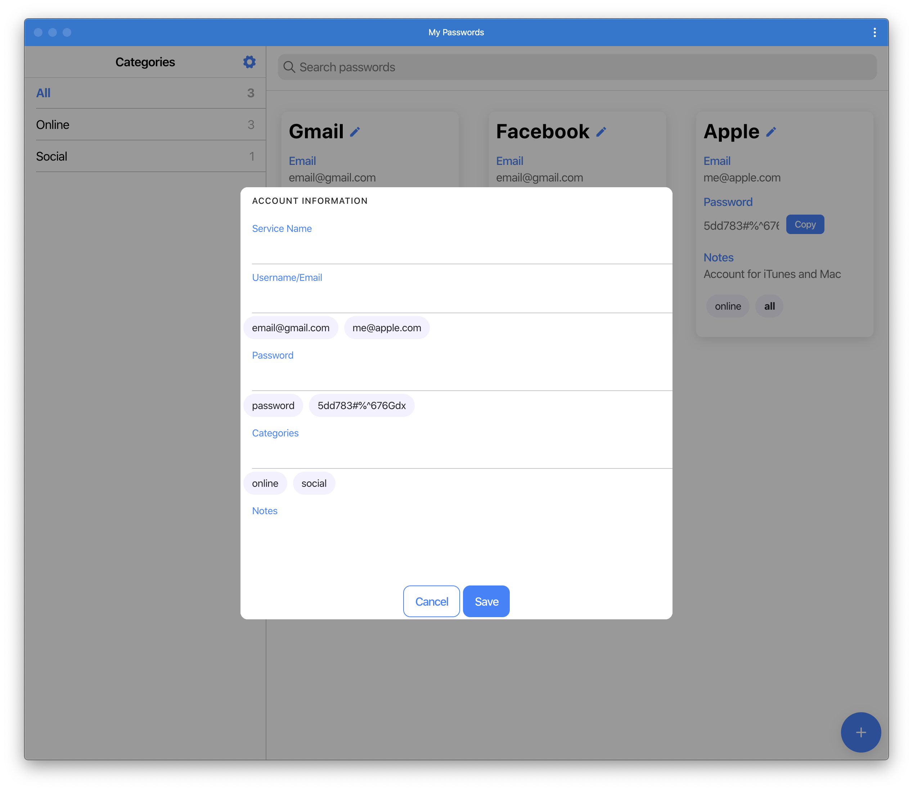
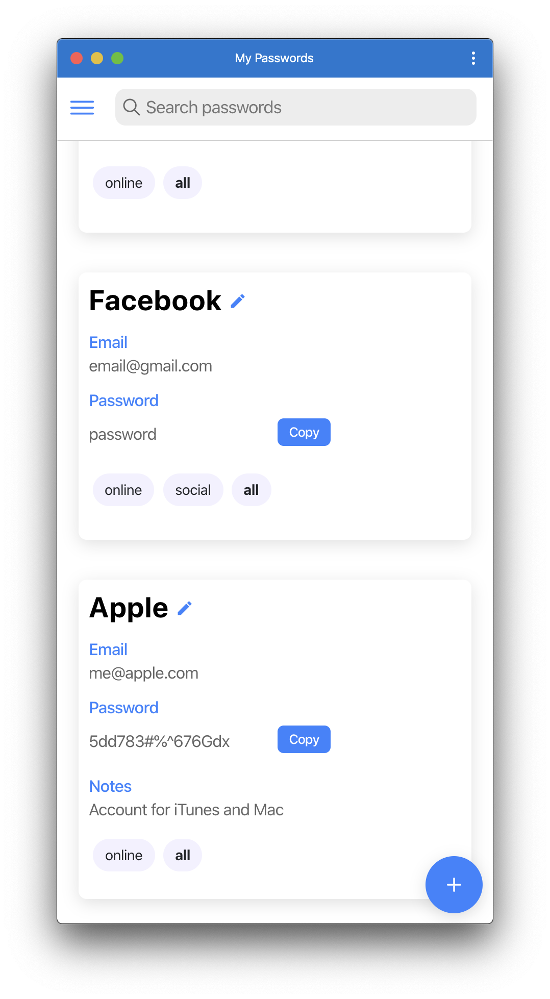
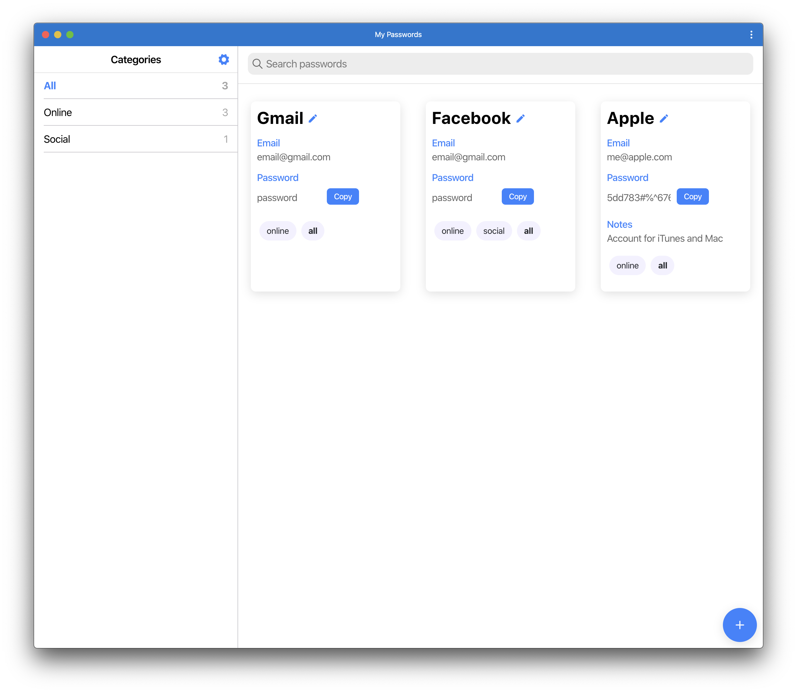
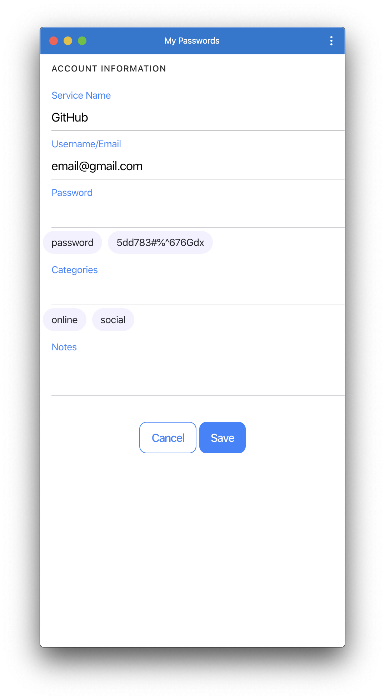

<p align="center">
  <a href="https://angularhunt.com/" target='_blank'>
    
  </a>
</p>

<p align="center">
  Rate & Discuss(coming soon) about open source angular projects.
</p>

<p align="center">
  <a href="https://angularhunt.com/" target='_blank'>Visit website</a>
</p>

# PasswordManager
A simple password manager I made for my mom to digitize her passwords. Made using Ionic Angular and 

## Features

- Access to the entire Apple Music library
- Access to your personal Music Library*


## Screenshots

Desktop                                   |  Mobile
:----------------------------------------:|:-------------------------:
  |  
  |  

## Development

This PWA is written using [Angular](https://vuejs.org).

### Getting started

```sh
git clone https://github.com/zachomedia/apple-music-webplayer.git
cd apple-music-webplayer

# Install dependencies
npm install

# Add the private settings
cp src/private.js.sample src/private.js

# Add your Developer Token to src/private.js
#  To generate one, see below.

# To run a local development instance
npm run serve

# To build the app (to dist folder)
npm run build
```
